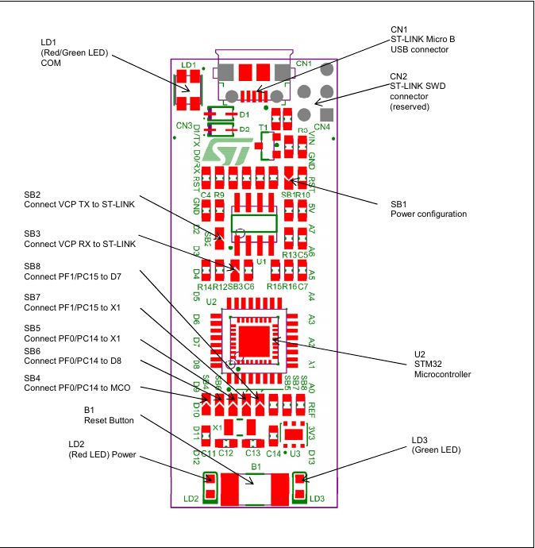
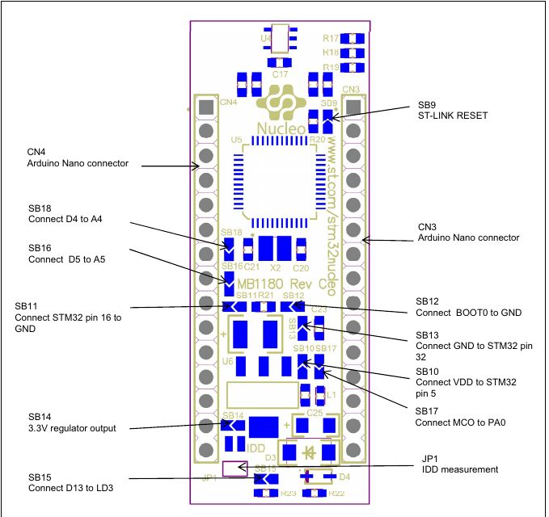

# PoF_SIM_L432
Firmware for Nucleo L432KC eval board for PoF SIM board.
Design environment: STM32CubeIde v1.14.0.

## Eval Board NUCLEO-L$#!KC, Solder beads



SB9 Off to power from +5V<br>
Note: SB16 and SB18 are better be OFF, they connect PA6-PB6 and PA5-PB5.<br>

## Pinout
```
//-----------------+-------------------+----------------------------------------
//    Pins          STM32               Arduino
#define LED_GREEN   GPIOA,GPIO_PIN_12// D2
#define LED_RED     GPIOA,GPIO_PIN_7//  A6
#define LED_BLUE    GPIOA,GPIO_PIN_6//  A5
#define SIM_A1      GPIOA,GPIO_PIN_11// D10 OpAmp gain
#define SIM_A0      GPIOA,GPIO_PIN_8//  D9  OpAmp gain
#define SIM_5V      GPIOC,GPIO_PIN_14// D7  5V_SW. Occupied by RCC_OSC32_OUT
#define SIM_SW_STATE GPIOB,GPIO_PIN_1// D6
#define SIM_POW_GOOD GPIOB,GPIO_PIN_6// D5
#define SIM_BUSY    GPIOB,GPIO_PIN_7//  D4  Not needed. The Busy state can be determined by bit31 of data.
#define SIM_CS      GPIOB,GPIO_PIN_0//  D3
#define SIM_SCK     GPIOB,GPIO_PIN_3//  D13 On L432 it is connected to LD3 Green
#define SIM_MISO    GPIOB,GPIO_PIN_4//  D12
#define SIM_MOSI    GPIOB,GPIO_PIN_5//  D11
#define SIM_WTX     GPIOA,GPIO_PIN_9//  TX
#define SIM_WRX     GPIOA,GPIO_PIN_10// RX
//-----------------+-------------------+----------------------------------------
Signal 5V_SW is not used on the SIM.
If, by some reason, 5V_SW is active, then following switches required:
SB4-OFF, SB6-ON, SB5-OFF, SB7-OFF, SB8-ON/OFF
```
[Pin Names](Docs/NUCLEO-L432KC_Nano_headersr.png)

[Nano Connector](Docs/NUCLEO-L432KC_Nano_connector.png)

## Power Consumption
Firmware 0.1.4 2024-08-19
- Whole board, sampling rate 7Hz: **0.25W, 50mA**.
- Whole board sampling rate 800Hz:  **0.18W**.
- Standalone STM32L432, SB9 Off, Power from USB: 0.280W, 54mA
- Standalone STM32L432, SB9 Off, Power from external +5V: 0.060W, 11mA

## Commands
Communication interface: UART1.
All data are ASCII strings.
Format of input commands `<CMD VALUE>`:
List of legal commands:
- `<STS?>`: Request board status. The board will respond with following ASCII string:<br>
```
    Ver 0.1.4 2024-08-19: <TSR:0,TO:160,RL:0,T:1382570,V:0.1.4>
```
- `<S Value>`: Set sampling rate of the ADC, Value is in range [0:7].
- `<R Value>`: Set recLimit, number of samples to transmit to PIM during each reporting interval.
- `<RI Value>`: Set reporting interval in milliseconds, default 1000.
- `<TO Value>`: Timeout for receiving one character from PIM, it defines data rate.
The actual data delivery interval is the sum of timeout value and the ADC conversion time.
- `<+5V Value>`: Turn On/Off the +5V switch, legal values: 1/0'
- `<DBG Value>`: Debugging control. Bit0: enable output to debugging UART2. Bits1,2 extended debugging. 
- `<G Value>`: Gain selection of the PAmp, legal values: [0:3].

## Testing/Debugging
The RS232 with 3.3V levels should be connected: RXD - to PA9 (W_TX), TXD - to PA10 (W_RX).

To communicate with the board over UART1:

    python3 -m serial.tools.miniterm /dev/ttyUSB0 57600

The UART2(over USB) sends debugging information, which is copy of the output sream of UART1

    python3 -m serial.tools.miniterm /dev/ttyACM0 115200

## Data stream from SIM to PIM.
The baud rate is the 57600. With ADC sampling rate of 800 Hz, SIM can deliver ~600 samples/s. The standard delivery is statistics over requested period, default 1 s. The statistics data are ASCII like this:

    <M498,60,-1340092,993,427,1371015>
    <M498,60,-1339997,1134,576,1372158>

Data format of the \<M...> record:<br>
**<Mn1,n2,n3,n4,n5,n6>**. Where n1 is number of samples, received from ADC 
since last report, n2 is number of samples, accumulated for statistics, 
n3: Mean\*10, n4: StDev\*10, n5: peak-to-peak amplitude, n6 clockCounter (1ms)<br>

If enabled, SIM will also deliver samples. For example: 

    <M7,7,-1339327,389,126,1371015><R-133932><R-133936><R-133954><R-133943><R-133980><R-133956><R-133939>
    <M7,7,-1339485,152,48,1372158><R-134004><R-133935><R-133932><R-133982><R-133959><R-133941><R-133932>

Data format (ASCII) of the \<R...> record:<br>
**\<Rn1>**. Where n1 is ADC reading.<br>
Reading 0 corresponds to 0V difference,  Minimal reading is -8388608 for -VREF/2, maximum reading is +8388608 for +VREF/2.

## Firmware flowchart.


## Noise
The RMS noise at higher rates depends on program behavior.
The single data transfer (chunk size = 1) shows smaller noise.
This is due to the PCB signalling is more synchronous with the ADC sampling.
The overall data rate is also faster with single data transfers because the 
transfer time overlaps with ADC conversion time.

Note. The interrrupt driven program may result with higher system noise because 
of program flow is less synchronous with the ADC sampling. 

## Project status
### v0.1.1 
ADC LTC2440 on eval board is supported. RMS reported, RMS ~1 LSB, or 0.3 uV.
This correspond to dynamic range of 23 bits or 140 dB!
Noise depends on program flow. For build 0.1.3 the RMS increased to 25 counts.
For previous builds it was 2.5 counts.

Power consumption from USB with DC570A = 65 mA, 0.32 mW.

Max sampling rate: 800 Hz.
Max data transfer rate over 57600 Baud serial connection is 572 Hz.

### v0.1.4 2024-08-16. Release
### v0.3.2 2025-12-20. Latest

## Issues
### Dependence of the ADC value from sampling rate.
ADC input shortened. Polling interval 1ms (PI=1).

  S0: <M 7,7,-7195,86,27
  S1: <M 14,14,-7251,117,50,>
  S2: <M 27,27,-7384,118,52,>
  S3: <M 27,27,-7429,121,48,>
  S4: <M 100,100,-7052,174,132,>
  S5: <M 166,100,-7835,172,80,>
  S6: <M 166,100,-5922,147,70,>
  S7: <M 495,100,-3598,112,52,>
  S8: <M 495,100,-1607,107,48,>

Here S is sampling rate selector.<br>
M: number of acquired samples, stat volume, mean*10, stdev*10, peak2peak.

Note, the acquired sampling rate maxes at 495 Hz.

If PI=4ms The data delivery is faster:
PI=4, S5: <M 198,100,-7940,167,85,>

The opimal setting for 200 Hz data rate: S5, PI=4.

Strange also that stdev drops when S>5.

Observation: This effect almost disappear when running in non-debugging mode.
